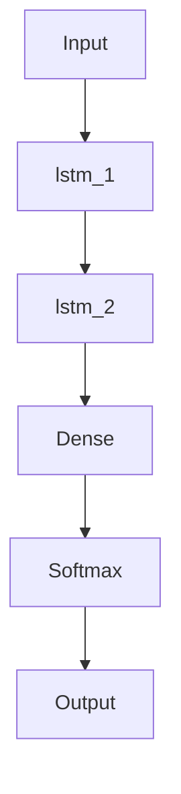

# 波形データのクラス分類サンプル
特定のデータに対してディープラーニングでクラス分類を行うサンプルです。
ニューラルネットワークモデルを使用しており、LSTM層を重ねることで実装を行っています。

## モデルアーキテクチャ

```mermaid
    graph TD;
        Input-->lstm_1;
        lstm_1-->lstm_2;
        lstm_2-->Dense;
        Dense-->Softmax;
        Softmax-->Output;
```
